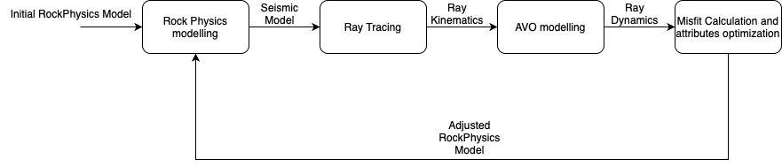

# RPSI
**R**ock **P**hysics **S**eismic **I**nversion is a python realization 
of seismic inversion direct in petro-elastic attributes. 
This algorithm minimizes misfits 
between observed and modeled seismic data by optimizing 
rock physics components.

## Algorithm

### 1. Rock physics modelling
The first stage is rock physics modeling. Its goal is to 
calculate seismic attributes (Vp, Vs, density) from the given rock physics ones. 
Any new model could be added. 
Available models:
* BGTL  *(Biot-Gassmann-Lee)*
* DEM *(differential effective medium)*
* Gassmann
* Kuster-Toksoz
* Voigt-Reuss-Hill

### 2. Seismic forward modelling (Ray Tracing + AVO modelling)
Seismic forward modeling calculates ray kinematics, ray dynamics, and seismograms from seismic attributes. 
This stage consists of two substages: 
Raytracing and AVO calculation.

### 3. Attributes optimization
Based on differences between the calculated and initial seismograms 
algorithm calculates adjusted values to the initial Rock Physics model. 
Adjusted values are passed to the 1st stage, and the algorithm recursively repeats.

## Contributing
Pull requests are welcome. For major changes, please open an issue first to discuss what you would like to change.

If you have any questions, please feel free to contact me 
via e-mail: *penkin.msu@gmail.com*

## License
[MIT](https://choosealicense.com/licenses/mit/)
